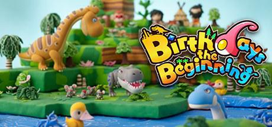

# Birthday the Beginning 诞辰之始

## 短评
试图重现物种起源的野心之作，作为生物方面的科普尚有可取之处。

- 优点：画风q萌，地形可以自己随意建造，变异生物的设定让人很有惊喜感

- 缺点：操作是在不太方便，视角操作很谜，建模不够精致

## 整体评价
总体而言，这个游戏属于我本身很认同的那种有寓教于乐功能潜力的好游戏，创意优秀，可惜本身游戏内建模不够吸引人，而且游戏玩法上略显单调，生物之间如何产生的内在联系不够严谨，作为游戏和科普性质的软件都不够完善。

## 我的修改
1. 改成类似我的世界的开放式地图方式
2. 纯粹像素化建模
3. 扮演最简单的动物，一步步进化，类似《孢子》，但是更加现实化一些

## 评分
- 游戏性：6
- 观赏性：5
- 教育性：7
- 娱乐性：4

总分：22

# Hot Guns 热枪

## 短评
相当传统的横版闯关射击游戏，暂时看来没有什么新意。

优点：武器有重量设定，拿多了武器就跳不起来

缺点：没有什么让人惊喜的地方

## 我的修改
1. 枪械更加多样化一些
2. 增加一些需要跳跃等操作才能躲避的小关卡
3. 增加子弹数量的设定